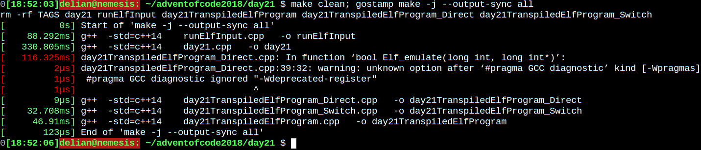
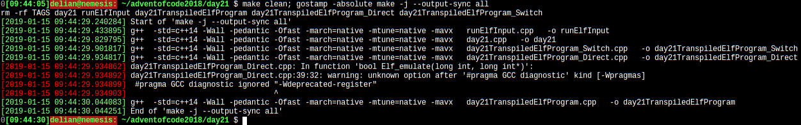

# gostamp
Timestamp and colorize the stdout and stderr streams of CLI programs.

(based on an idea by HN user chrismorgan here: https://news.ycombinator.com/item?id=18898764)

# Examples:
This example shows a default invokation of 'gostamp', running 'make', which produces both stdout and stderr lines:

As you can see, it is easy to distinguish between stderr (red timestamps) and stdout (green timestamps).

The example below shows the effect of the -absolute option:

# Installation:
    go get -u github.com/spytheman/gostamp

# Usage:
    gostamp - Timestamp and colorize the stdout and stderr streams of CLI programs.
    Usage: gostamp [options] program [programoptions] 
      The options are:
      -absolute
            use absolute timestamps
      -color
            colorize the output (default true)
      -elapsed
            use timestamps, showing the elapsed time from the start of the program. Can not be used with -absolute
      -end
            timestamp the end of the execution (default true)
      -merge
            merge stderr to stdout. Useful for later filtering with grep.
      -micro
            round timestamps to microseconds, instead of milliseconds. Can not be used with -absolute
      -start
            timestamp the start of the execution (default true)
      -version
            show the tool version
